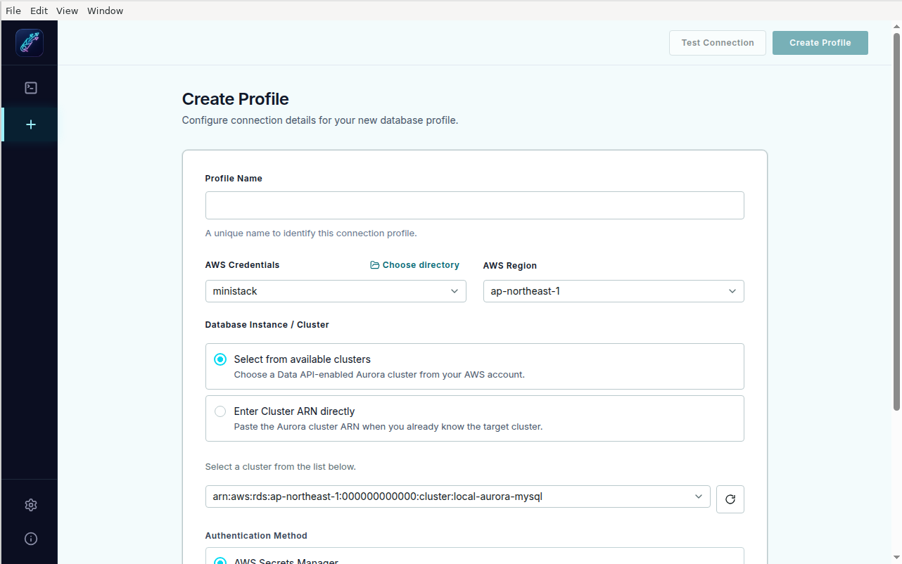
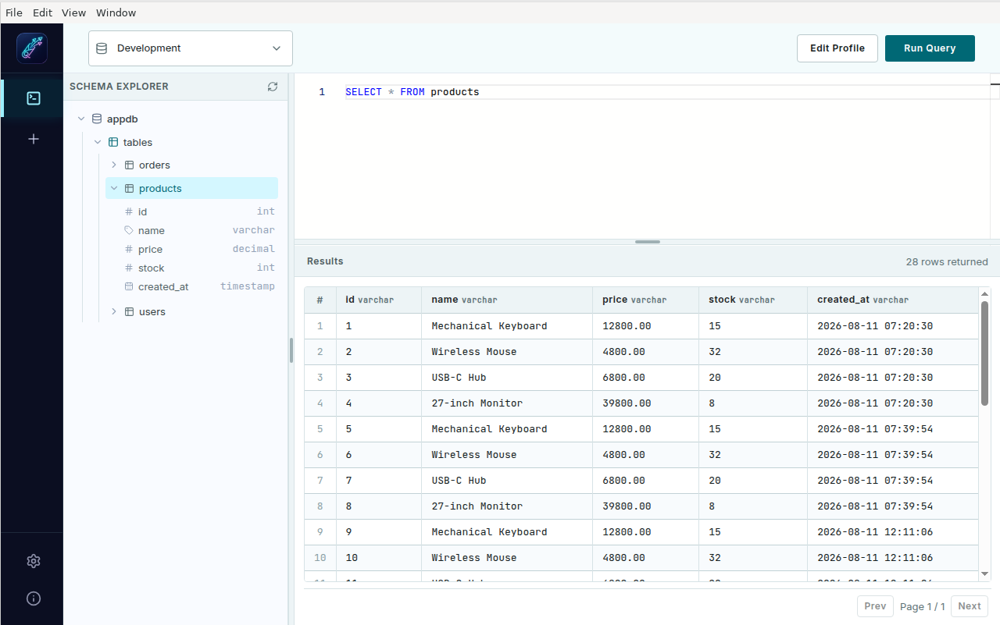

# Quiver

Quiver is a desktop database client for Amazon Aurora built around the AWS RDS Data API. It lets developers reuse AWS profiles and saved connection profiles while inspecting schemas and running SQL without opening a direct database TCP connection from the application.

Quiver currently supports Aurora MySQL and Aurora PostgreSQL through AWS-native APIs.

## Features

- Discover and select AWS credential profiles
- Discover Aurora clusters and test connections with `SELECT 1`
- Create, edit, and delete saved connection profiles
- Inspect tables and columns through Schema Explorer
- Run SQL through the Amazon RDS Data API and view tabular results
- Configure the application language in Settings
- Use English (`en`), Japanese (`ja`), or Simplified Chinese (`zh-CN`)

## Screens

- Create Profile
- Edit Profile
- Query Editor
- Settings
- Info

Screen specifications are available in the [documentation](#documentation).

## Screenshots



*Create a connection profile by selecting AWS credentials, region, cluster details, and testing the connection before saving.*



*Inspect tables and columns, run SQL through the RDS Data API, and review tabular results in one workspace.*

## Requirements

### For installed applications

- Windows x64, macOS Intel/Apple Silicon, or Linux x64
- An AWS account with access to the target Aurora cluster
- An Aurora cluster with the RDS Data API enabled
- A Secrets Manager secret used by the Data API
- AWS credentials configured as a named profile or in the default AWS credentials location

### For development

- Node.js 20 LTS or later
- npm
- Docker and Docker Compose for MiniStack-based local validation

## Installation

Download the latest release from [GitHub Releases](https://github.com/ladymade/quiver-rds-data-api-client/releases).

| Platform | Artifact |
| --- | --- |
| Windows | `.exe` NSIS installer, x64 |
| macOS | `.dmg`, x64 or arm64 |
| Linux | `.AppImage`, x64 |

On Linux, make the AppImage executable before launching it:

```bash
chmod +x Quiver-*.AppImage
./Quiver-*.AppImage
```

Current installers are unsigned and automatic updates are not included. Your operating system may display a security warning. Verify that downloads come from the official GitHub Releases page before launching them.

## First-time setup

1. Configure AWS credentials using the AWS CLI or another supported AWS credential source. Quiver reads the default AWS credentials directory (`~/.aws`) and can also use a custom credentials directory from Create Profile.
2. Confirm that the Aurora cluster has the RDS Data API enabled and that the selected AWS identity can access RDS Data API and Secrets Manager.
3. Launch Quiver and open **Create Profile**.
4. Select an AWS credential profile and region.
5. Select an Aurora cluster or enter its cluster ARN, then provide the Secrets Manager secret ARN and database name.
6. Select the database engine if it is not detected automatically.
7. Use **Test Connection**, then save the profile.
8. Open the saved profile in **Query Editor** to inspect the schema and run SQL.

Quiver does not store or expose AWS secret values in the renderer UI. Keep the local AWS credentials directory protected by your operating system.

## Development

Install dependencies and start the Electron application with its main, preload, and renderer processes:

```bash
npm install
npm run dev
```

Build the application and verify the expected artifacts:

```bash
npm run build
npm run verify:dist
```

Run the quality checks used by the project:

```bash
npm run lint
npm run format
```

## Local testing with MiniStack

MiniStack provides a local substitute for the AWS services used by the E2E tests. Start and initialize it before running the MiniStack project:

```bash
npm run ministack:up
npm run ministack:init
npm run test:e2e:ministack
npm run ministack:down
```

For a focused smoke test, use:

```bash
npm run test:e2e:smoke
```

Useful commands include `npm run ministack:logs`, `npm run ministack:reset`, `npm run test:e2e:headed`, and `npm run test:e2e:report`.

## Packaging

Electron Builder writes release artifacts to `release/`:

```bash
npm run package
```

Platform-specific commands are available when their build requirements are installed:

```bash
npm run package:linux
npm run package:mac
npm run package:win
```

The Windows packaging command also checks for the required Windows build environment. Cross-platform packaging is limited by platform signing and native build requirements; run the command on the target platform when possible.

## Architecture

Quiver follows a clean-layer architecture:

- **Main process**: AWS SDK calls, local persistence, and IPC handlers
- **Preload**: the secure `contextBridge` between Electron processes
- **Renderer**: React UI only; it does not access Node.js APIs directly
- **Shared**: typed IPC contracts used by main and renderer
- **Infrastructure**: AWS and storage implementations behind domain interfaces

AWS SDK usage stays in the infrastructure layer, and the renderer does not receive AWS credentials or secret values.

## Limitations

- Only Aurora MySQL and Aurora PostgreSQL through the RDS Data API are supported.
- Quiver does not open direct database TCP connections.
- Automatic updates are not implemented.
- Release installers are currently unsigned.
- Query history, AWS SSO improvements, and richer schema visualization remain future work.

## Troubleshooting

- **No AWS profiles appear**: verify the credentials file exists under `~/.aws`, or select the correct custom credentials directory in Create Profile.
- **No clusters appear**: confirm the selected region, AWS profile permissions, and that the cluster is Aurora with the RDS Data API enabled.
- **Connection test fails**: verify the cluster ARN, secret ARN, database name, engine, and permissions for both RDS Data API and Secrets Manager.
- **The AppImage does not launch**: confirm it is executable with `chmod +x` and check whether the Linux desktop environment reports a missing runtime dependency.

When reporting a problem, never include AWS access keys, secret values, tokens, or production credentials.

## Project structure

```text
quiver/
├── src/
│   ├── main/
│   │   ├── application/
│   │   ├── domain/
│   │   ├── infrastructure/
│   │   ├── interfaces/
│   │   └── index.ts
│   ├── preload/
│   ├── renderer/
│   ├── shared/
│   └── ...
├── docs/
├── docker/
├── e2e/
├── scripts/
├── build/
├── electron-builder.yml
├── package.json
└── README.md
```

## Documentation

- [Project overview](docs/PROJECT_OVERVIEW.md)
- [Create Profile](docs/CREATE_PROFILE_SCREEN.md)
- [Edit Profile](docs/EDIT_PROFILE_SCREEN.md)
- [Query Editor](docs/QUERY_EDITOR_SCREEN.md)
- [Settings](docs/SETTINGS_SCREEN.md)
- [Release guide](docs/RELEASING.md)
- [Contributing](CONTRIBUTING.md)
- [Security policy](SECURITY.md)

## Contributing

Contributions are welcome. Please read [CONTRIBUTING.md](CONTRIBUTING.md) before opening a pull request. Keep AWS and RDS logic in the infrastructure layer, use the shared IPC types, and avoid committing credentials or environment-specific files.

## Security

Do not commit credentials or secrets. For vulnerability reports, follow [SECURITY.md](SECURITY.md) instead of opening a public issue.

## License

Quiver is licensed under the MIT License. See [LICENSE](LICENSE) for details.
